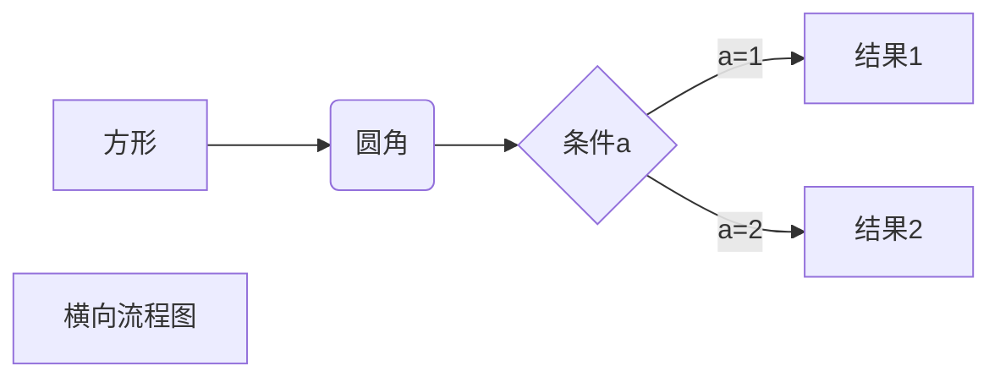
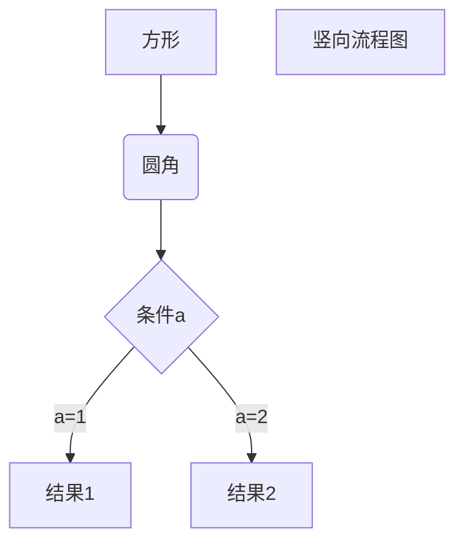

## markdowm学习笔记  

### 1.markdown是什么？

Markdown 是一种轻量级标记语言，它允许人们使用易读易写的纯文本格式编写文档。

Markdown 语言在 2004 由约翰·格鲁伯（英语：John Gruber）创建。

Markdown 编写的文档可以导出 HTML 、Word、图像、PDF、Epub 等多种格式的文档。

Markdown 编写的文档后缀为 **.md**, **.markdown**。

### 2.markdown标题

Markdown 标题有两种格式。

1.使用 = 和 - 标记一级和二级标题  （不用）

====这是一级标题

2.使用#表示的标题（程度由#号的数量改变，#号越少字体越大）

### 3.markdown段落格式

Markdown 段落没有特殊的格式，直接编写文字就好，**段落的换行是使用两个以上空格加上回车**。

你好你好你好

### 4.markdown字体 

```
*斜体文本*
_斜体文本_
**粗体文本**
__粗体文本__
***粗斜体文本***

```

*斜体文本*	_斜体文本_

**粗体文本**	__粗体文本__

***粗斜体文本***	___粗斜体文本___

### 5.markdown分割线

你可以在一行中用三个以上的星号、减号、底线来建立一个分隔线，行内不能有其他东西。你也可以在星号或是减号中间插入空格。下面每种写法都可以建立分隔线：

```
***
---
```

***

*****

### 6.删除线

```
~~BAIDU.COM~~
```

~~删除~~

###  7.下划线

```
<u>带下划线文本</u>
```

<u>带下划线文本</u>

### 8.脚注

```
[^要注明的文本]
```

我会有脚注[^这是我的脚注哦]

[^这是我的脚注哦]: 其实没啥用

### 9.markdown列表

Markdown 支持有序列表和无序列表。

无序列表使用星号(*****)、加号(**+**)或是减号(**-**)作为列表标记

```
* 第一项
* 第二项

+ 第一项
+ 第二项

- 第一项
- 第二项
```

* 无序无序*
* 无序无序

+ 无序+

+ 无序-

有序列表使用数字并加上 **.** 号来表示，如： （退出直接回车换行）

```
1. 第一项
2. 第二项
3. 第三项
```

1. 第一
2. 第二

### 10.列表嵌套

列表嵌套只需在子列表中的选项添加四个空格即可：（不用四个空格）

```
1. 第一项：
    - 第一项嵌套的第一个元素
    - 第一项嵌套的第二个元素
2. 第二项：
    - 第二项嵌套的第一个元素
    - 第二项嵌套的第二个元素
```

1. 第一项
       - 第一个
       - 第二个
2. 第二项
   - 第一个
3. 第三
   - 第一

### 11.markdown区块

Markdown 区块引用是在段落开头使用 **>** 符号 ，然后后面紧跟一个**空格**符号：

```
> 区块引用
> 辉哥辉哥
> 学的不仅是技术更是梦想
```

> 辉哥
>
> > 第二个辉哥
>
> 6不6

区块中使用列表

>
>
>* 简单
>* so easy

列表中使用区块

1. 第一

   > so easy
   >
   > so easy too

2. 第二

### 12.markdown代码

如果是段落上的一个函数或片段的代码可以用反引号把它包起来（**`**），例如：

```
`printf()` 函数
```

`console.log("hello world")`

代码区块：

代码区块使用 **4 个空格**或者一个**制表符（Tab 键）**。（不用）

你也可以用 **```** 包裹一段代码，并指定一种语言（也可以不指定）：

```javascript
console.log("hello world")
```

### 13.markdown链接

```
这是一个链接 [菜鸟教程](https://www.runoob.com)
```

这是一个链接 [菜鸟](https://www.runoob.com)

直接使用链接地址：

```
<https://www.runoob.com>
```

<http://www.baidu.com>

### 14.markdown图片

Markdown 图片语法格式如下：

```


```

​	

Markdown 还没有办法指定图片的高度与宽度，如果你需要的话，你可以使用普通的  标签。

### 15.Markdown 表格

Markdown 制作表格使用 **|** 来分隔不同的单元格，使用 **-** 来分隔表头和其他行。

语法格式如下：

```
|  表头   | 表头  |
|  ----  | ----  |
| 单元格  | 单元格 |
| 单元格  | 单元格 |
```

| 表头 | 表头 |
| ---- | ---- |
|      |      |
|      |      |

### 16.markdown高级技巧

##### 支持的html元素

不在 Markdown 涵盖范围之内的标签，都可以直接在文档里面用 HTML 撰写。

目前支持的 HTML 元素有：`     <kbd> <b> <i> <em> <sup> <sub> <br>  `等 

##### 转义

Markdown 使用了很多特殊符号来表示特定的意义，如果需要显示特定的符号则需要使用转义字符，Markdown 使用反斜杠转义特殊字符：

```
**文本加粗** 
\*\* 正常显示星号 \*\*
```

\*\*正常显示星号\*\*

##### 图表代码

1.横向流程图




2.竖向流程图




